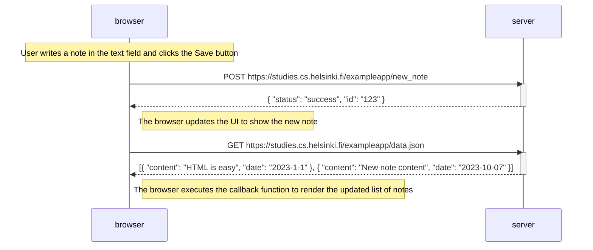

```mermaid
sequenceDiagram
    participant browser
    participant server
 
    Note over browser: User writes a note in the text field and clicks the Save button
 
    browser->>server: POST https://studies.cs.helsinki.fi/exampleapp/new_note
    activate server
    server-->>browser: { "status": "success", "id": "123" }
    deactivate server
 
    Note right of browser: The browser updates the UI to show the new note
    browser->>server: GET https://studies.cs.helsinki.fi/exampleapp/data.json
    activate server
    server-->>browser: [{ "content": "HTML is easy", "date": "2023-1-1" }, { "content": "New note content", "date": "2023-10-07" }]
    deactivate server
 
    Note right of browser: The browser executes the callback function to render the updated list of notes
```